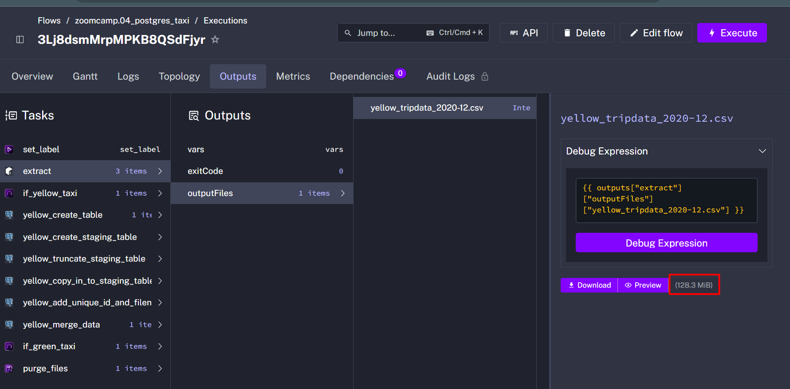
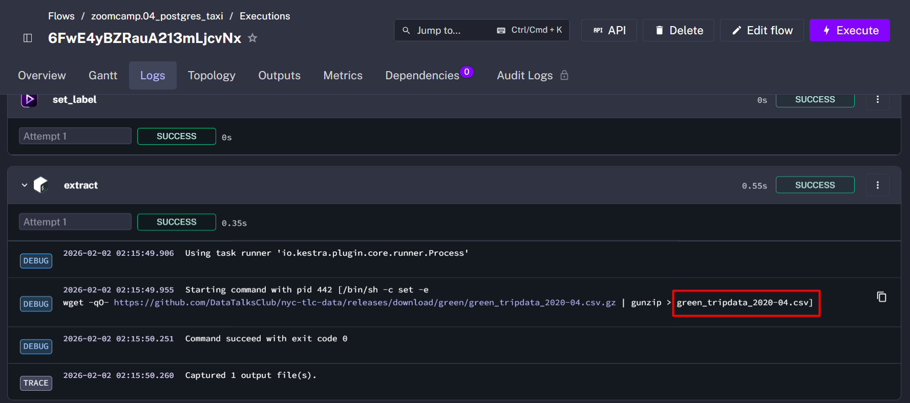

# Módulo 2 - Tarea: Orquestación de flujo de trabajo con Kestra

### Preguntas del Quiz

Completa el quiz que se muestra a continuación. Es un conjunto de 6 preguntas de opción múltiple para evaluar tu comprensión de la orquestación de flujos de trabajo, Kestra y pipelines ETL.

1) Dentro de la ejecución para los datos de taxis `Yellow` del año `2020` y mes `12`: ¿cuál es el tamaño del archivo sin comprimir (es decir, el archivo de salida `yellow_tripdata_2020-12.csv` de la tarea `extract`)?
- 128.3 MiB



2) ¿Cuál es el valor renderizado de la variable `file` cuando la entrada `taxi` está configurada como `green`, `year` está configurado como `2020`, y `month` está configurado como `04` durante la ejecución?
- `green_tripdata_2020-04.csv`



3) ¿Cuántas filas hay en los datos de taxis `Yellow` para todos los archivos CSV del año 2020?

```sql  
SELECT COUNT(*)
FROM public.yellow_tripdata
WHERE filename LIKE 'yellow_tripdata_2020-%';
```
- 24,648,499

4) ¿Cuántas filas hay en los datos de taxis `Green` para todos los archivos CSV del año 2020?

```sql  
SELECT COUNT(*)
FROM public.green_tripdata
WHERE filename LIKE 'green_tripdata_2020-%';
```
- 1,734,051

5) ¿Cuántas filas hay en los datos de taxis `Yellow` para el archivo CSV de marzo 2021?

```sql  
SELECT COUNT(*) FROM public.yellow_tripdata
WHERE filename LIKE 'yellow_tripdata_2021-03%'
```
- 1,925,152


6) ¿Cómo configurarías la zona horaria a Nueva York en un trigger de Schedule?

- Add a `timezone` property set to `America/New_York` in the `Schedule` trigger configuration

